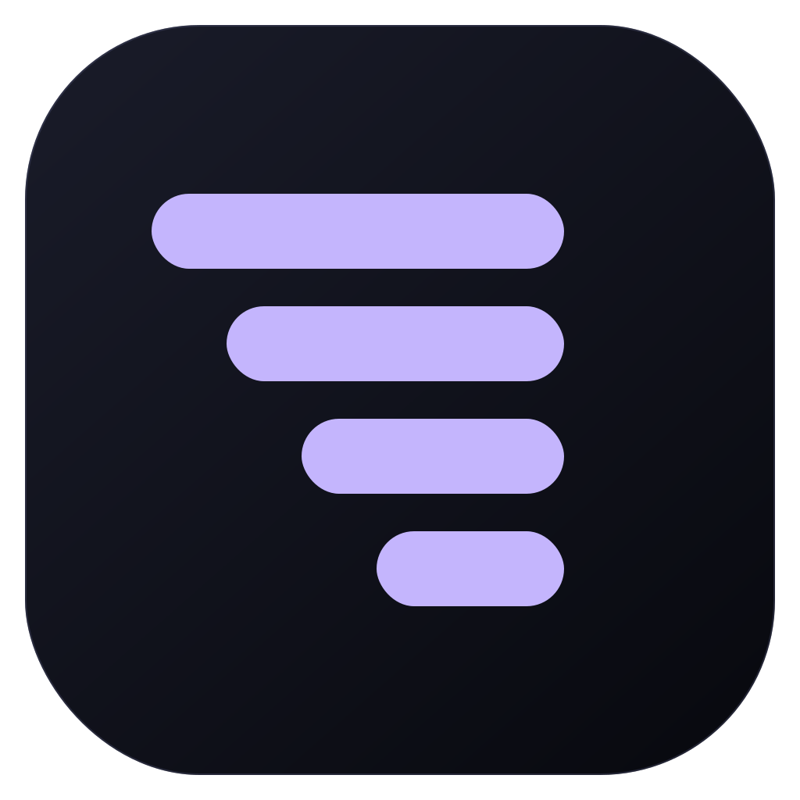

<p align="center">
  
</p>

<h1 align="center">Agent Group</h1>

<p align="center">
  A local-first workspace for building with multiple coding agents in one real project.
</p>

<p align="center">
  <a href="https://github.com/beileng1998/agent-group/actions/workflows/ci.yml">
    
  </a>
  <a href="https://github.com/beileng1998/agent-group/releases/latest">
    
  </a>
  <a href="LICENSE">
    
  </a>
</p>

Agent Group brings coding-agent conversations, project files, terminals, a browser, diffs, and
approvals into one desktop application. Every Session has its own durable conversation and explicit
`context.md`, while every Agent works in the Group's shared project directory.

[Download the latest desktop release](https://github.com/beileng1998/agent-group/releases/latest)
for macOS, Windows, or Linux.

> [!WARNING]
> Agent Group is under active development. Back up important work, use version control, and review
> agent actions before relying on it for production workflows.

## Why Agent Group

Most agent tools organize work around one provider conversation. Agent Group organizes it around
your project instead: split work into nested Sessions, select the best Agent for each Turn, and keep
continuity in local, inspectable files rather than a hidden global memory.

### Multiple agents, one project

- Run **Codex, Claude Code, Cursor, Antigravity, Grok, Factory Droid, Kilo Code, OpenCode, and Pi**
  from one interface.
- Switch provider, model, reasoning level, or mode between Turns without moving the Session to a
  different workspace.
- Discover provider models, skills, slash commands, and usage information when the provider exposes
  them.
- Follow streaming text, plans, tool calls, runtime subagents, approval requests, and questions in
  one consistent transcript.
- Queue follow-up work while a Turn is active; each queued Turn retains the Agent selection made
  when it was sent.

### Explicit Context and Group Awareness

- Give every Session a raw Markdown `context.md` that the user and Agent can read and maintain.
- Create nested Sessions that receive their parent's Context on the first Turn.
- Mention another Session to give an Agent an explicit Context and transcript reference.
- Enable **Awareness** per Session so an Agent can inspect relevant Context changes made elsewhere
  in the Group since its last Turn.
- Apply global and Group rules verbatim, choose Context templates, and inspect or customize the
  prompt assembly from Settings.
- Keep continuity understandable: there are no hidden summaries, opaque “one brain” memories, or
  per-Session copies of the project.

### A focused workspace for each Session

- Open Session Context, Highlights, Side, Explorer, Terminal, Browser, and Diff as tabbed panels.
- Browse project files and preview source, images, Markdown, and PDFs without leaving the Session.
- Run multiple terminal tabs and split terminal layouts in the same workspace.
- Give a Session its own browser state for local app testing and agent-driven browser work.
- Review working-tree and Turn diffs, jump between changed files, and leave line-level comments for
  the next prompt.
- Attach files, images, pasted text, directories, and terminal output to a request; Codex can also
  transcribe voice notes when it is signed in with ChatGPT.
- Open files or the project in installed editors and receive desktop or browser notifications when
  work needs attention.

### Keep parallel work visible

- Search, pin, rename, reorder, nest, and collapse Groups and Sessions from the project tree.
- See which Agent owns the active Turn and whether a Session is working, waiting for approval or
  input, presenting a plan, completed, or in error.
- Start a focused Side conversation from selected transcript content, then promote it into the
  Session tree when it should become durable work.
- Pin useful assistant messages to Highlights so decisions and results stay easy to revisit.

## Groups, Sessions, Turns, and Agents

| Concept     | What it means                                                                          |
| ----------- | -------------------------------------------------------------------------------------- |
| **Group**   | One project, one canonical workspace root, and shared Group rules.                     |
| **Session** | A durable, nestable conversation with its own Context and preferred Agent.             |
| **Turn**    | One immutable request with the provider, model, and options selected when it was sent. |
| **Agent**   | The Turn's provider and model selection—not another copy of the project.               |

```text
Group: one project directory
├── Session: implement the feature       → context.md → Codex this Turn
│   ├── Session: research the API         → context.md → Claude this Turn
│   └── Session: test the mobile flow     → context.md → Cursor this Turn
└── Session: review the final diff        → context.md → another selected Agent
```

All Sessions run in the Group's canonical project directory and see the same files. They do not own
separate worktrees. The Session tree organizes conversations and Context, while normal source
control coordinates changes to the shared codebase.

## How Context continuity works

Session Context lives inside the project:

```text
.agent-group/
├── .git/                         # private Context history, separate from project Git
├── state.json                    # app-owned Session and awareness metadata
└── sessions/
    └── <session-id>/context.md   # raw user/Agent Markdown
```

Agent Group does not parse, normalize, summarize, or rewrite the structure of `context.md`. The
application shows it read-only; the user and Agent edit the file directly in the workspace.

Awareness is optional and pull-based. When Context files from other Sessions have changed since a
Session's last awareness cursor, Agent Group adds a bounded Context Git diff command to the next
prompt. The Agent decides whether to run it and which changes matter. The diff itself is not stuffed
into every prompt, and Context Git never touches the project's Git history.

Provider switching also stays explicit. At a Turn boundary, Agent Group stops the old native
binding, starts the selected adapter in the same workspace, and gives it the visible Session
transcript once. Switching back starts a fresh provider binding instead of reviving a stale provider
cursor.

See the [Workspace Protocol](docs/AGENT_GROUP_PROTOCOL.md) and
[Architecture](docs/ARCHITECTURE.md) for the exact lifecycle and concurrency rules.

## Mobile access with Tailscale and PWA

Agent Group can be used from iOS, iPadOS, and Android without moving the workspace or agents off
the desktop. The responsive web app becomes an installable PWA, while the desktop remains the
source of truth for files, terminals, browser sessions, credentials, and running Agents.

```text
iOS / Android PWA
  → encrypted user Tailnet
  → embedded userspace Tailscale node
  → Agent Group server on desktop loopback
  → local workspace and Agents
```

To connect a phone:

1. Connect the phone to your Tailscale network.
2. In the Agent Group desktop app, open **Settings → Mobile Access** and enable the embedded
   Tailnet node.
3. Complete the one-time Tailscale sign-in and device approval, if your Tailnet requires it.
4. Create a one-use QR pairing code, scan it on the phone, and choose **Install app** or
   **Add to Home Screen** in the browser.

The server remains bound to localhost. The embedded sidecar listens only inside the user's Tailnet,
and browser access requires a separate revocable Agent Group session created by the pairing flow.
Agent Group does not use a cloud relay, public port forwarding, Tailscale Funnel, or an offline copy
of transcripts and project data.

Read [Mobile Access](docs/mobile-access.md) for the topology, HTTPS/PWA requirements, pairing model,
and security invariants. For a manually hosted authenticated web server, see
[Remote Access](docs/remote-access.md).

## Get started

### Install a desktop release

| Platform | Release artifact              |
| -------- | ----------------------------- |
| macOS    | Apple Silicon or Intel `.dmg` |
| Windows  | Windows 10/11 x64 `.exe`      |
| Linux    | x64 AppImage                  |

macOS builds use an ad-hoc signature when Developer ID signing is unavailable. On first launch,
Gatekeeper may still require **Control-click → Open** or approval in **Privacy & Security**.

1. Install and sign in to at least one supported Agent CLI.
2. [Download Agent Group](https://github.com/beileng1998/agent-group/releases/latest) and open a
   project directory.
3. Create a Session, choose an available Agent and model, and send the first request.

Agent Group detects provider tools from `PATH`. Settings also provides provider visibility,
installation health, custom binary paths, and automatic CLI update checks.

### Run from source

Install the Bun and Node.js versions declared in [`package.json`](package.json), Git, and at least
one supported Agent CLI or SDK:

```sh
bun install --frozen-lockfile
bun run dev
```

To build and launch the desktop application:

```sh
bun run build:desktop
bun run electron
```

See [Development](docs/development.md) for isolated development instances and focused verification.

## Repository architecture

Agent Group is a Bun monorepo with a React web client, a local orchestration server, an Electron
desktop shell, and a small Go Tailnet sidecar.

| Path                  | Responsibility                                                                    |
| --------------------- | --------------------------------------------------------------------------------- |
| `apps/web`            | Responsive React workspace shared by desktop, web, and PWA surfaces.              |
| `apps/server`         | Local API, durable orchestration, provider adapters, Context, Git, and terminals. |
| `apps/desktop`        | Electron lifecycle, native browser integration, updates, and OS features.         |
| `apps/tailnet`        | Embedded `tsnet` sidecar and private reverse proxy for mobile access.             |
| `apps/marketing`      | Astro download and project site.                                                  |
| `packages/contracts`  | Schema-only contracts shared across process boundaries.                           |
| `packages/shared`     | Explicit shared runtime and UI utilities.                                         |
| `packages/effect-acp` | ACP protocol support used by compatible provider adapters.                        |

Provider adapters are replaceable runtime bindings beneath the same Group/Session/Turn model. The
orchestration layer owns durable conversations; provider-native session IDs are implementation
details.

## Security and privacy

Projects, Sessions, application history, and Agent Group Context are stored on the local machine.
Prompts, file excerpts, tool results, and other data needed for a Turn are sent directly to the
provider selected for that Turn. Agent Group does not provide a hosted workspace backend.

Agents can run commands and modify files. The default Full Access mode runs without per-command
approval and should be treated like direct terminal access to the project. Review diffs, keep work
under version control, and open untrusted repositories in an isolated environment.

Never expose an unauthenticated Agent Group server outside localhost. Use the built-in Tailnet flow
or explicit authentication on a trusted private network. See the [Security Policy](SECURITY.md) for
the threat model and vulnerability reporting process.

## Documentation and contributing

- [Documentation index](docs/README.md)
- [Workspace Protocol](docs/AGENT_GROUP_PROTOCOL.md)
- [Architecture](docs/ARCHITECTURE.md)
- [Mobile Access](docs/mobile-access.md)
- [Remote Access](docs/remote-access.md)
- [Keyboard shortcuts](docs/keybindings.md)
- [Contributing](CONTRIBUTING.md)
- [Code of Conduct](CODE_OF_CONDUCT.md)

Focused bug fixes, reliability and performance improvements, documentation, and maintenance
contributions are welcome. Please read [Contributing](CONTRIBUTING.md) before proposing a large
feature or architectural change.

## Upstream

Agent Group is based on [Synara](https://github.com/Emanuele-web04/synara) v0.5.5, commit
`9be46c3c`. This is source attribution only. Upstream review is limited to Agent adapter
capabilities; product identity and packaging remain independent.

## License

Agent Group is available under the [MIT License](LICENSE). Upstream attribution is recorded in
[NOTICE.md](NOTICE.md), and third-party terms are described in
[THIRD_PARTY_NOTICES.md](THIRD_PARTY_NOTICES.md).
